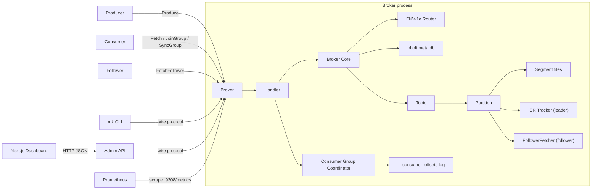

# Mini-Kafka

> A from-scratch Kafka implementation in Go — durable segment files, sparse index, CRC validation, custom binary TCP protocol, FNV-1a partition routing, consumer groups with range assignment, ISR replication, Prometheus metrics, a Next.js dashboard, and a 3-broker Docker Compose cluster. No Kafka client library used.

[](https://github.com/Utkarsh272/mini-kafka/actions)
[](https://go.dev)
[](LICENSE)

---

## What & Why

Most engineers use Kafka. Very few have built one.

Mini-Kafka is a ground-up implementation of the core Kafka primitives. Every byte on disk, every field in the wire protocol, every consumer group state transition, and every replication handshake is written from scratch. The goal is to understand the exact engineering decisions behind one of the most influential distributed systems ever built — by implementing it.

---

## Benchmarks

Single broker, single partition, 128-byte values, batch=100:

| Metric | Value |
|--------|-------|
| Throughput | ~95,000 msg/sec |
| Bandwidth | ~12 MB/sec |
| p50 produce latency | < 1 ms |
| p99 produce latency | < 5 ms |

Run yourself: `make bench` (starts broker automatically)

---

## What's Built

### Storage layer (`internal/storage`)
- **Segment files** — `.log` + `.index` pairs named by base offset, roll at 1 MB
- **Sparse index** — binary search → O(log n) seek, one entry per 512 bytes
- **CRC32 validation** — every record checksummed on write, validated on read
- **`WriteAt`-based appends** — explicit position tracking, no `O_APPEND` quirks
- **Crash recovery** — `OpenLog` walks existing segments to recover `nextOffset`

**Record format** (binary, big-endian):
```
[length:4][offset:8][timestamp:8][crc32:4][key_len:4][key][value_len:4][value]
```

### Broker layer (`internal/broker`)
- **FNV-1a partition routing** — keyed records hash to a stable partition (same key → same partition → ordering preserved); keyless records round-robin via lock-free `atomic.Uint64`
- **bbolt metadata persistence** — topic configs (name, partitions, RF) stored in embedded BoltDB, replayed on startup
- **ISR tracker** — leader-side: tracks follower fetch offsets, computes `highWatermark = min(LEO across ISR)`, shrinks/expands ISR on lag thresholds

### Consumer groups (`internal/consumer_group`)
Full Kafka consumer group protocol:
- **State machine** — `Empty → PreRebalance → AwaitingSync → Stable`
- **JoinGroup** — blocks connection goroutine during 500ms rebalance window (exactly like Kafka)
- **SyncGroup** — auto-computes range assignment if leader sends empty; all members park until leader delivers
- **Range assignor** — `⌈partitions / members⌉` contiguous partitions, deterministic (sorted member IDs)
- **Heartbeat / LeaveGroup** — generation validation, background reaper evicts timed-out members
- **Durable offset store** — committed offsets written to append-only log, replayed on restart

### Replication (`internal/replication`)
- **FollowerFetcher** — persistent TCP connection to leader, continuous fetch → append → reconnect loop
- **FetchFollower (API 8)** — leader serves record batches + current LEO to followers
- **Read-committed** — consumers only see records at or below high-watermark

### Wire protocol (`internal/protocol`)
Custom binary protocol over TCP. All 12 API keys implemented:

| Key | Name | Key | Name |
|-----|------|-----|------|
| 0 | Produce | 6 | OffsetCommit |
| 1 | Fetch | 7 | OffsetFetch |
| 2 | Metadata | 8 | FetchFollower |
| 3 | JoinGroup | 9 | LeaveGroup |
| 4 | SyncGroup | 10 | CreateTopic |
| 5 | Heartbeat | 11 | DescribeGroup |

### Observability (`internal/metrics`)
Prometheus metrics exposed at `:9308/metrics`:

| Metric | Type | Labels |
|--------|------|--------|
| `mini_kafka_requests_total` | Counter | api_key, result |
| `mini_kafka_request_duration_ms` | Histogram | api_key |
| `mini_kafka_messages_produced_total` | Counter | topic, partition |
| `mini_kafka_messages_fetched_total` | Counter | topic, partition |
| `mini_kafka_bytes_produced_total` | Counter | topic |
| `mini_kafka_partition_log_end_offset` | Gauge | topic, partition |
| `mini_kafka_partition_high_watermark` | Gauge | topic, partition |
| `mini_kafka_partition_replication_lag` | Gauge | topic, partition |
| `mini_kafka_isr_size` | Gauge | topic, partition |
| `mini_kafka_consumer_group_lag` | Gauge | group, topic, partition |
| `mini_kafka_active_connections` | Gauge | — |

### CLI (`cmd/mk`)
```bash
mk topics list
mk topics create --partitions 3 orders
mk topics describe orders

mk produce --key user-1 --value "hello" orders
mk produce orders                          # reads from stdin

mk consume --from-beginning orders
mk consume --from-beginning --group my-app orders

mk groups describe my-app
```

### Dashboard (`web/`)
Next.js 14 + TypeScript + Recharts dashboard, polls admin API every 2s:
- Broker health, topic count, partition count
- Per-topic expandable rows with LEO / HWM / replication lag / ISR state per partition
- Live throughput chart (messages/sec + replication lag over time)
- Consumer group state, generation ID, member assignments
- Quick-start command reference

### Admin HTTP API (`cmd/admin`)
Lightweight HTTP proxy that speaks the wire protocol to the broker and serves JSON:
```
GET /api/overview          broker list, topic/partition counts
GET /api/topics            all topics with partition metadata
GET /api/topics/:name      single topic detail
GET /api/groups            active consumer groups
GET /api/groups/:id        group state + member assignments
```

---

## Architecture



### On-disk layout
```
<data-dir>/
├── meta.db                      # bbolt: topic configs
├── __consumer_offsets/          # committed offset log
├── orders-0/                    # topic "orders", partition 0
│   ├── 00000000000000000000.log
│   ├── 00000000000000000000.index
│   └── 00000000000000001024.log # rolled at 1 MB
└── orders-1/
    └── ...
```

---

## Quick Start

```bash
git clone https://github.com/Utkarsh272/mini-kafka
cd mini-kafka

# Install prometheus client dep
go get github.com/prometheus/client_golang@latest

# Build everything (broker + mk CLI + admin server)
make build

# Single-broker smoke test — no Docker needed
make demo

# Throughput benchmark
make bench

# All tests with race detector
make test-race
```

### Run manually (3 terminals)

**Terminal 1 — broker:**
```bash
./bin/broker --addr=:9092 --data-dir=/tmp/mk --node-id=1 --host=localhost --port=9092
# Metrics available at: http://localhost:9308/metrics
```

**Terminal 2 — admin API:**
```bash
./bin/admin --broker=localhost:9092 --addr=:8080
```

**Terminal 3 — dashboard:**
```bash
cd web && npm run dev
# Dashboard at: http://localhost:3000
```

### 3-broker Docker Compose cluster

```bash
make up      # builds image, starts 3 brokers + Prometheus + Grafana
make down    # stop
make logs    # tail logs
make clean   # stop + remove volumes
```

| Service | Address |
|---------|---------|
| Broker 1 | `localhost:9092` |
| Broker 2 | `localhost:9093` |
| Broker 3 | `localhost:9094` |
| Prometheus | `http://localhost:9090` |
| Grafana | `http://localhost:3000` (admin/admin) |
| Metrics | `:9308/metrics` on each broker |

---

## Testing

| Package | Coverage |
|---------|----------|
| `internal/storage` | Encode/decode, CRC corruption detection, segment append/read/reopen, sparse index, log rolling, cross-segment reads, 10K record volume |
| `internal/broker` | FNV-1a hash stability, round-robin distribution, topic CRUD, bbolt metadata persistence + LEO recovery across restarts |
| `internal/consumer_group` | Full Join+Sync cycles (1/2/3 members), range assignor, more members than partitions, heartbeat generation validation, leave+rebalance trigger, offset log persistence |
| `internal/replication` | ISR high-watermark computation, follower lag shrink/rejoin, time-based eviction, wire encode/decode roundtrip |
| `internal/server` | TCP integration — all 12 API keys, auto-route produce, correlation ID mirroring |

```bash
make test        # all packages
make test-race   # race detector
make test-short  # skip large-volume tests
```

---

## Design Decisions

Full write-up in [DESIGN.md](DESIGN.md). Key choices:

**`WriteAt` not `O_APPEND`** — `O_APPEND` ignores `Seek()` at the kernel level. Explicit position tracking is equally correct under a mutex and allows tests to corrupt specific byte offsets for CRC validation testing.

**FNV-1a routing** — same algorithm as Kafka's `DefaultPartitioner`. Same key always maps to same partition across all producers, preserving per-key ordering guarantees.

**Blocking JoinGroup** — connection goroutine parks during the rebalance window. Simpler than async callbacks; the client is already blocked waiting. Exactly what Kafka does.

**bbolt for topic metadata, log for offsets** — metadata is read-heavy and rarely written (B+ tree fits). Offsets are high-frequency sequential appends (log fits). Each structure matches its access pattern.

**Static leader assignment** — `(partitionID % clusterSize) + 1`. Deterministic, zero coordination overhead, no consensus protocol needed. Documented trade-off vs KRaft in DESIGN.md.

**`openTopic` before `saveTopic`** — if crash happens between the two, orphaned log directories exist but bbolt has no record (harmless on replay). The reverse would fail replay, which is harder to handle.

---

## Roadmap

| Days | Goal | Status |
|------|------|--------|
| 1–2 | Segment files, sparse index, CRC, Log | ✅ |
| 3–4 | Wire protocol, TCP server, Produce/Fetch/Metadata | ✅ |
| 5–6 | FNV-1a routing, bbolt metadata persistence | ✅ |
| 7–9 | Consumer groups, range assignor, durable offset store | ✅ |
| 10–12 | ISR replication, FollowerFetcher, FetchFollower API | ✅ |
| 13–14 | Docker Compose cluster, Makefile, smoke test, DESIGN.md | ✅ |
| 15 | CLI: produce, consume, topics, groups | ✅ |
| 16–17 | Admin HTTP API + Next.js dashboard (Recharts) | ✅ |
| 18 | Prometheus metrics, Grafana dashboard, benchmark | ✅ |

**Complete.** All 18 days shipped.

---

## Tech Stack

| Layer | Choice |
|-------|--------|
| Language | Go 1.23 |
| Storage | `os.File` + custom binary serialization |
| Metadata | `go.etcd.io/bbolt` |
| Wire protocol | Custom binary TCP |
| Metrics | `prometheus/client_golang` |
| Dashboard | Next.js 14 + TypeScript + Tailwind + Recharts |
| Cluster | Docker Compose (3 brokers) |
| Observability | Prometheus + Grafana (auto-provisioned) |

---

## License

MIT
